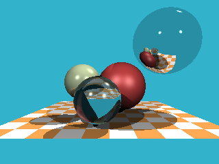

# Get-the-Balance-Right
I ported this 256 line C++ [tinyraytracer](https://github.com/ssloy/tinyraytracer) by Mr. Dmitry V. Sokolov ([ssloy](https://github.com/ssloy))  
to several game engines that use higher level languages.  
Some older ones (but still quite popular) and some more recent ones.  
 
All projects are made to display execution time in milliseconds, so that performance could be compared.  
Operations include: trigonometry, vector math and data structure access.  
Output to screen is not timed. 
Shaders are not used. 
 
|engine|ms|
|:---|---:|
|C++ (original - file output)|350|
|<b>GML||
|Game Maker 8.0|109000|
|Enigma 0.0.5.0|65500|
|<i>OpenGMK|64000|
|GameMaker Studio 1.4 (VM)|40900|
|GameMaker Studio 1.4 (YYC)|7900|
|GameMaker Studio 1.4 (HTML5)|2600|
|GameMaker Studio 2.2.5 (VM)|38800|
|<b>Lua||
|Defold 1.6.0 (LuaJIT 2.1.0-b3)|5500|
|LÖVE 11.4 (LuaJIT 2.1.0-b3)|3700|
|<b>Ruby||
|RPG Maker XP (Ruby 1.8.1)|108000|
|RPG Maker VX (Ruby 1.8.1)|84000|
|RPG Maker VX Ace (Ruby 1.9.2)|18200|
|<i>RGDirect 1.5.4|61500|
|<i>MKXP-Z|40000|
|<b>JavaScript||
|RPG Maker MV 1.6.3 (clean)|2200|
|<b>Python / Pythonlike||
|Godot 3.5.3 (GDScript)|5700|
|Godot 4.1.2 (GDScript)|4700|
|Pygame 2.5.2 (Python 3.7.2)|4300|
|<b>C#||
|Godot 3.5.3 (C#)|660|
|Godot 4.1.2 (C#)|230|
 
These could also be useful as a 'Hello World!' programs, when moving from engine to engine 
and you want to familiarize yourself by jumping right in, instead of going through tutorials. 
 
Enjoy! 
